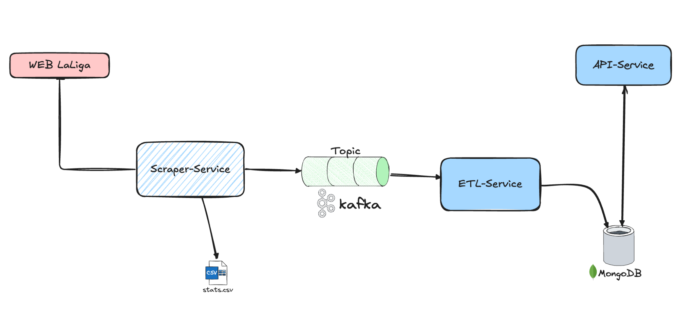

# 🏟️ **Football Cloud**

**Football Cloud** is a personal project designed to apply and enhance my skills in microservices architecture design and backend application development. The primary goal is to create a platform that provides real football match data from the **Spanish Professional Football League (LaLiga)** for free via an API, using modern technologies and integrations to ensure efficient and accessible data flow.

The system automates the process of manually extracting data from LaLiga's official website, publishing the raw data to a **Kafka** topic. From there, two main microservices handle the processing and exposure of the data:

1. **Data Transformation Microservice (ETL-Service)**:  
   - Consumes raw data from the Kafka topic.  
   - Transforms, cleans, and stores the data in a **MongoDB** database.

2. **REST API Microservice (API-Service)**:  
   - Provides RESTful endpoints developed with **FastAPI**.  
   - Allows external applications to query the processed data from MongoDB for analysis and visualization.

This project facilitates free access to football data through a modular and maintainable platform, leveraging technologies like **Docker**, **Kafka**, **MongoDB**, and **FastAPI** to efficiently integrate different services.

---

## 🌐 **Project Description**

The project focuses on three key stages:

1. **Data Collection**:  
   A dedicated service performs web scraping on LaLiga's official website, capturing match statistics manually.

2. **Data Transformation**:  
   The collected data is sent through Kafka, where an ETL microservice consumes, cleans, transforms, and stores it in a NoSQL database (MongoDB).

3. **Data Delivery**:  
   A RESTful API provides access to the stored data, allowing other applications or systems to efficiently query and use the information.

---

## 🏗️ **System Architecture**



### **Workflow Explanation**

1. **`Scraper-Service`**  
   - **Function**: Collects football match data manually from LaLiga's official website using web scraping techniques with Selenium.  
   - **Output**: Publishes the raw data (in bytes) to a Kafka topic and optionally saves it as a local CSV file (`stats.csv`).  
   - **Execution**: Runs locally due to the requirement of having Google Chrome installed.

2. **Kafka**  
   - **Function**: Acts as a message broker to handle asynchronous communication between the `Scraper-Service` and the `ETL-Service`.  
   - **Topic**: Temporarily stores the raw data, allowing the scraping process to be decoupled from data transformation.

3. **`ETL-Service`**  
   - **Function**:  
     - Consumes data from the Kafka topic.  
     - Cleans, transforms, and formats the data.  
     - Stores the processed data in MongoDB.

4. **`API-Service`**  
   - **Function**: Provides HTTP endpoints to query and retrieve the stored data from MongoDB.  
   - **Technology**: Developed with FastAPI for efficient and scalable access to the data.

---

## 🚀 **Features**

- **Manual Web Scraping**: Collect football data using Selenium and Chrome Headless.
- **Asynchronous Communication**: Kafka enables scalable and decoupled data processing.
- **Data Transformation**: ETL pipeline ensures data is cleaned and structured for analysis.
- **RESTful API**: FastAPI provides easy access to the processed data.
- **Flexible Data Storage**: MongoDB stores data in JSON format for efficient querying.

---

## 🛠️ **Technologies Used**

- **Web Scraping**: `Selenium` with `Chrome Headless`
- **Message Broker**: `Apache Kafka`
- **API Framework**: `FastAPI`
- **Database**: `MongoDB`
- **Containerization**: `Docker` and `Docker Compose`
- **Programming Language**: `Python`
- **Data Analysis**: `Pandas`
- **Visualization**: (Future) `React` or `Vue.js`

---

## 🚀 **How to Run the Project**

### 1. Clone the Repository

```bash
git clone https://github.com/your-username/football-cloud.git
cd football-cloud
